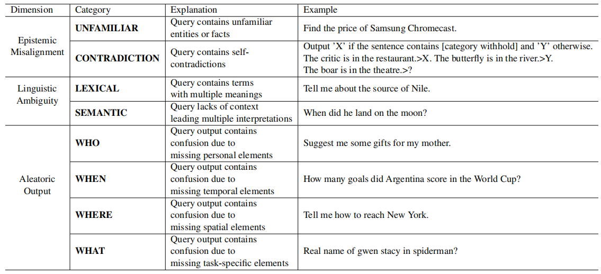

# CLAMBER: A Benchmark of Identifying and Clarifying Ambiguous Information Needs in Large Language Models
> **Co-author**: Tong Zhang (Sichuan University), Peixin Qin (Sichuan University)

This is the benchmark dataset, called **CLAMBER**, which is used to evaluate LLMs using a well-organized taxonomy in terms of identifying and clarifying ambiguous information needs.
## Paper
[Click Me](https://arxiv.org/abs/2405.12063)


## Ambiguity Taxonomy in the era of LLM



## Dataset Information
我们将很快更新
字段信息，每个字段的取值范围


# Reference
If you make advantage of the DREditor in your research, please cite the following in your manuscript:

```
@misc{zhang2024clamber,
      title={CLAMBER: A Benchmark of Identifying and Clarifying Ambiguous Information Needs in Large Language Models}, 
      author={Tong Zhang and Peixin Qin and Yang Deng and Chen Huang and Wenqiang Lei and Junhong Liu and Dingnan Jin and Hongru Liang and Tat-Seng Chua},
      year={2024},
      booktitle = {Proceedings of the 62nd Annual Meeting of the Association for Computational Linguistics (ACL)},
}
```
